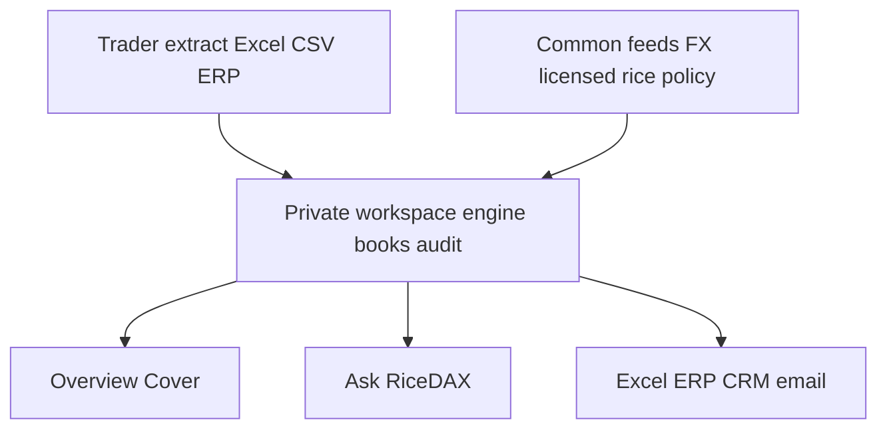
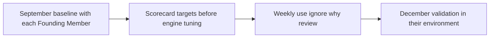

# Solution information (Annex B)

Paste-ready answers for the EnterpriseSG FormSG **Solution Information** fields. Use with [eoi-proposal.md](eoi-proposal.md) (summary) and [application-suggestions.md](application-suggestions.md) (UI mapping). Trader-facing screens still follow [rice-trader-language.md](rice-trader-language.md).

**Solution name:** RiceDAX  
**Live exhibit:** https://ricedax.com (passphrase supplied separately)

Each section below is: what the exhibit runs **now**, what we ship **October–December**, and the **decision point** if a choice is still open. https://ricedax.com is the September conversation piece, not the October prototype. October is a new package on the trader’s extract, in the trader’s environment. See [LEARNING.md](LEARNING.md) for what is real vs labelled synthetic.

---

## 1. Overall tech stack (data, model, application)

RiceDAX is one private workspace per firm. Two applications sit on one engine: **Ask RiceDAX** (the chatbot the EOI asked for) and **Overview / Stock & Cover / Cover** (the dashboard). We did not train a rice foundation model. The cover bit is computed. The prose is layered on.

### Layers

| Layer | Now (exhibit) | October–December | Evidence |
| --- | --- | --- | --- |
| **Data** | CSV ingest of private books (stock, sales, open POs, suppliers) plus labelled common series (FOB, freight, FX, policy notes). Every evidence row is tagged `private` / `permissioned` / `aggregated` / `common`. | Same classes. Start from the firm’s actual Excel/ERP extract; write adapters rather than forcing our CSV first. Licensed rice FOB and intra-ASEAN freight if we can buy them; otherwise labelled placeholders. | Data page import; `data/pacific-grain/` (private) vs `data/market/` (common). USD/SGD can be live (Frankfurter / ECB). Rice FOB and freight on the exhibit are synthetic. |
| **Engine (the model that produces the call)** | Typed rules: commercial cover, MSR buffer, est. CFR (FOB + freight), FX, supply-risk → COVER / WATCH / HOLD. Tests without a language model. Forecasting is trailing velocity, not a trained predictor. | Same recommendation object. Classical demand/inventory models only if September baselines show the rule is too weak. Still not a rice foundation model. Trained only on that firm’s history, on that firm’s machine. | Cover page; `lib/engine/recommend.ts`; `lib/engine/recommend.test.ts`. |
| **Ask RiceDAX (chatbot)** | Multi-turn thread. Deterministic tools over the engine (`getInventory`, `getRecommendation`, `runScenario`, `draftRfq`) plus templated desk answers. Seeded walkthrough: why Vietnam over Thailand; hold off two weeks; what’s on the water. `OPENAI_API_KEY` is reserved and unused. | Optional tool-using LLM over the same tools. The LLM never originates COVER / WATCH / HOLD. If the language model is down, Overview still produces the call. | Ask RiceDAX; `lib/copilot.ts`. |
| **Applications** | Next.js 16 / React 19 / TypeScript dashboard and chatbot. Node 22. Prisma 6 over SQLite (same schema later on the trader’s Postgres). | Same surfaces, real users and roles, firm extract instead of Pacific Grain fixtures. | Overview, Stock & Cover, Cover, Market, RFQ, Ask RiceDAX, Value, Data. |
| **Export / customisation** | Private downloads from this workspace: Excel/CSV stock and cover, ERP-shaped JSON, CRM buyer-file note, RFQ email draft. | Map those payloads onto the firm’s SAP / Oracle / Dynamics / email after September file mapping. | Data → export. |
| **Audit and monitoring** | Local hash-linked event log. Optional ForteL2 integrity receipt of a 32-byte tip (demo-labelled on the exhibit). `/health` for liveness and which deploy home served the request. | Same local chain. Live RPC optional. Per-user roles. Override counts as an efficacy input. | Value → audit trail; `GET /health`. |
| **Store** | SQLite file on the workspace disk. | SQLite or the trader’s Postgres, same schema. Firm data does not sync to Fresco. | `DATABASE_URL`; Docker volume stays with the trader. |
| **Deploy** | One Docker/Node image. Binds `0.0.0.0:$PORT`. Three homes (below). Exhibit today is Render in Singapore, operated by us for the EOI only. | Same image in the trader’s on-prem, VPC, or own public-cloud account. | Data → where this workspace runs; `Dockerfile`; `docker-compose.yml`; `docs/screenshots/health.json`. |

### What this is not

Not an exchange, a token, a custodian, or a central warehouse of firm books. Architecture and industry infrastructure come after the procurement problem. Do not open FormSG with blockchain.

---

## 2. Data architecture, including security measures and safeguards

### Flow

Private books enter the workspace. Common feeds (FX, later licensed rice and freight, policy notes) enter the same workspace. The engine writes a structured cover call. Overview and Ask RiceDAX read that call. Export payloads go back to Excel, ERP, CRM, and email. Nothing in this path requires firm data to leave the trader’s environment.

### Four data classes (enforced in the product)

Every evidence row on Cover is tagged. The Market pane shows only common series.

| Class | Examples | Default | Now | October–December |
| --- | --- | --- | --- | --- |
| **Private** | Inventory, sales, open POs, supplier terms, working capital, MSR lots, bids, margins | Never leaves the trader environment | Pacific Grain pack is private. Ask RiceDAX cannot see another trader. | Firm extract stays on their disk. Fresco does not store a copy. |
| **Permissioned** | Supplier performance, completed shipment proofs | Shared only for an approved purpose | Schema-ready; not shared in the exhibit | Shared only with prior approval and a written purpose |
| **Aggregated** | Historic benchmarks, lead-time observations | Only after cohort, latency, and competition-law controls | **Not done.** We refused to aggregate two traders. | Still not in 2026 unless CCCS-safe controls exist. Not a 2026 deliverable. |
| **Common** | Public FX, public policy notes, reference origin/grade taxonomy; later licensed FOB/freight | Network-wide | Market pane. Rice FOB and freight on the exhibit are labelled synthetic. USD/SGD can be live. | Licensed sheets if purchased; otherwise labelled placeholders. No silent synthetic. |

**Safeguard for FormSG:** firm-level data is not stored by the provider. No firm data is shared without prior approval.

### Security measures

| Control | Now (exhibit) | October–December |
| --- | --- | --- |
| **Residency** | Workspace database and files live with the process. Docker Compose comment: firm data stays in this container’s volume. The Render exhibit reseeds on restart (ephemeral disk); that is exhibit packaging, not the firm deploy. | Trader-owned machine, VPC disk, or cloud account. No sync to Fresco. |
| **Access** | Demo passphrase (`DEMO_PASSWORD`), httpOnly cookie, public routes limited to `/login`, `/health`, `/robots.txt`. | Per-user roles (buyer, approver, technical owner). Passphrase was an exhibit gate. |
| **Least data in prompts** | Ask RiceDAX calls tools; it does not dump the book into a prompt. Competitor / other-trader questions are refused in code. | Same refusal. LLM, if enabled, is tool-using over engine output, not a dump of private rows. |
| **Audit** | Append-only hash chain of recommendation, approval, RFQ, and copilot turns. HMAC checkpoint. Optional 32-byte tip on ForteL2 — never stock, prices, or identity. Exhibit receipt is labelled **demo**. | Same local chain. Live RPC optional. Trading screens do not change. |
| **Monitoring** | `GET /health` (ok, packaging, which home). Copilot daily cap. | Health plus override counts, ingest-breakage, and recommendation throughput. |
| **Competition law (CCCS)** | We do not pool current, individualised strategic information among competitors. Market shows common series only. | Same rule. Aggregation, if ever, waits for cohort size, latency, and legal review. |

SFA reviews the MSR / regulatory representation only. SFA does not see commercial books.

---

## 3. Deployment approach for the base engine at individual firms

“Base model” in the EOI means the **shared rice-domain engine and common data layer**, not a foundation LLM. One application image. The trader chooses the home. Firm-level recommendations are generated locally. Firm-level data is not stored by Fresco.

### One image, three homes

The trader picks one. Evidence is on the Data page and at `/health` (`packaging: same-image-three-homes`).

| Home | Fit | How | Exhibit evidence |
| --- | --- | --- | --- |
| **On-premises** | Strict residency, stable compute, in-house IT | `docker compose up --build` or `npm start`. SQLite or their Postgres. Binds `0.0.0.0:$PORT`. No firm data leaves the building. | Local `/health` reports `home: on-premises`. `Dockerfile` + `docker-compose.yml`. Saved proof: `docs/screenshots/health.json`. |
| **Trader private cloud** | Residency without owning hardware | Same image in the trader’s VPC. They own the account and the disk. | Same `/health` packaging list. Non-local, non-exhibit host reports private-cloud style. |
| **Trader public cloud** | Flexible compute, low upfront cost | Same image in the trader’s **own** AWS, Azure, or GCP account. | https://ricedax.com is this packaging, operated by us for the EOI only. October runs in the trader’s account, not ours. |

Confirm in FormSG that we can deliver all three.

### What is customised at the firm vs what stays shared

| Stays the base engine (Fresco + Founding Members + SFA on the constraint) | Customised on the firm’s machine |
| --- | --- |
| Cover / WATCH / HOLD object shape | Their Excel / ERP extract and adapters |
| Dual stock pools (commercial and MSR) | Their cover days, MSR lots, last-paid, supplier list |
| Origin / grade taxonomy; RFQ payload shape | Later: SAP / Oracle / Dynamics / email connectors |
| Common feeds (FX, licensed rice/freight, policy notes) | Optional on-prem SLM vs API LLM for Ask RiceDAX prose |
| Audit event shape | Their users, roles, and approval chain |

### Prerequisites (October)

- A weekly inventory / sales extract. CSV or Excel is enough; we adapt to their workbook.
- Outbound HTTPS if they want live FX.
- Someone who can approve a cover call (the override habit is the weekly review).
- For Docker: a host that can run the image. For Node: Node 22.

### Path to each firm

1. **September** — sit with the buyer; photograph the files they actually use; agree dual-inventory rules with them and SFA; pick the home.
2. **End October** — prototype runs on *their* extract in *their* environment, not on our Render service.
3. **End December** — packaged for the chosen home; they can drop a new extract without us in the room.

What scales in 2027 is the same package plus the common layer, not a central warehouse of firm books.

---

## 4. Proposed model types and decision points

**Product rule:** the structured recommendation is computed first. Prose is layered on. If the language model is down, Overview still produces COVER / WATCH / HOLD.

We are not proposing a rice foundation model.

| Type | Role | When we use it | When we do not |
| --- | --- | --- | --- |
| **Rules + landed-cost arithmetic** | Source of the bit: cover vs target, MSR buffer, est. CFR (FOB + named freight), FX, supply-risk. Testable. | Now, and remaining the default through December. | Never skip this layer. |
| **Classical demand / inventory ML** (exponential smoothing, Croston-style, safety-stock) | Firm-level forecast and cover projection. | Only if September baselines show trailing velocity is too weak for that firm’s sales history. Trained only on that firm’s data, on that firm’s machine. | Not trained on other firms. Not a shared predictor. Demand-forecast MAPE is not claimed until this ships. |
| **Small language model (SLM)** | Optional on-prem explanation layer for Ask RiceDAX if the firm cannot send prompts out. | After the firm’s data-residency choice, if they require air-gapped prose. Still tool-using over engine output. | Not the source of COVER / WATCH / HOLD. |
| **Frontier LLM** | Optional richer multi-turn language for Ask RiceDAX, tool-using over the same engine tools. | If the firm allows an API and wants desk-quality thread language. | Never as the buy/watch/hold bit. Unused on the exhibit (`OPENAI_API_KEY` reserved). |

### Decision points (write these in FormSG)

1. **Rules vs classical ML** — decided per firm after September baselines (days of cover, last emergency cover, sales-history quality). Default is rules. We add a predictor only when the rule is demonstrably too dumb, and we put the forecast-error line on the Value scorecard before we tune.
2. **SLM vs frontier LLM** — decided per firm after the deploy-home and residency conversation. On-prem / air-gapped → SLM or deterministic templates. Trader cloud with outbound API → optional frontier LLM. Either way, Overview does not depend on it.
3. **Licensed rice FOB and freight vs labelled placeholders** — decided when we can buy the sheet. Until then the series is labelled. We will not silently treat synthetic FOB as an assessment.
4. **MSR / SFA representation** — the exhibit uses a synthetic stand-in. October replaces it with the rule as the trader and SFA understand the circular. SFA reviews that representation only.

### How Ask RiceDAX uses a model (when one is on)

Tools first, language second:

- `getInventory` — commercial cover, MSR buffer, on-the-water POs (computed).
- `getRecommendation` — the engine output (computed).
- `runScenario` — same engine under FX or freight shock (computed).
- `draftRfq` — RFQ payload from an approved call (computed).

The language model, if present, writes the desk paragraph from those tool results. It cannot originate a COVER the engine did not produce.

---

## 5. Proposed framework on how solution efficacy would be measured and evidenced

The measurement frame is the **Value scorecard** (https://ricedax.com/scorecard). Exhibit figures are **placeholders** until a live baseline is agreed with each Founding Member. We will not claim a dollar of “savings” that is only a price move.

### Principle

Compare against an agreed policy and against that firm’s own baseline, not against a market tick we picked. Override is a feature: use / ignore / tell us why is the weekly review, not a support ticket.

### Dimensions

| Dimension | Metric | How evidenced | Note |
| --- | --- | --- | --- |
| Procurement | Est. CFR vs last paid, vs an **agreed cover policy** | Engine inputs + executed POs after December | Not vs every Platts tick. FOB + freight is est. CFR Singapore, not “landed cost.” |
| Stock & cover | Average days of commercial cover | Weekly extract vs target / minimum cover | Dual pools: commercial and MSR are not blended into one runway. |
| Working capital | Capital tied up in excess stock vs target cover | Stock × agreed value vs 85-day (or firm) target | Directional until their costing method is mapped. |
| Availability | Emergency-cover events per year | Count of off-cycle / distressed covers | Baseline from the buyer in September (last emergency buy). |
| Forecasting | Demand forecast error (MAPE) | Only if a forecast model ships (decision point 1) | v0 uses trailing velocity. Do not claim MAPE until the predictor exists. |
| Operations | Hours per week gathering market information | Diary study in the October prototype | Buyer time, not engineering time. |
| Workflow | Time from identified requirement to approved PO | RFQ state machine timestamps | Exhibit path stops at quote compare — no PO, no payment. |
| Adoption | Recommendations reviewed / used / overridden | Product counters + weekly review notes | The override reasons are the engine’s training data. |

### Evidence path (not a claimed result)

1. **September** — agree baseline numbers with the buyer: current days of commercial cover, last emergency cover, hours gathering prices, time from “we need rice” to approved PO. Put those numbers on the scorecard before we tune the engine.
2. **October–December** — weekly review of calls used, ignored, or overridden, and why. Ingest breakage on their real workbook is a product metric, not a shame metric.
3. **End December** — same scorecard, filled from their environment. Numerical targets are firm-specific. We do not publish a cross-trader savings figure.

Monitoring that supports the frame: `/health`, audit chain verification, copilot-turn log, recommendation override counts.

---

## 6. Training and capability building so firms can operate independently

The December gate is: the firm can drop a new weekly extract and read the cover call without Fresco in the room. We remain on an SLA for the **base engine and common data** (patches, feed subscriptions, three-year maintain), not for day-to-day cover decisions.

### Roles at the firm

| Role | Who | What they must be able to do without us |
| --- | --- | --- |
| **Buyer** | The person who today lives in Excel, email, and a broker WhatsApp | Open Overview; read COVER / WATCH / HOLD; use Ask RiceDAX on the same call; approve or hold; say why if they override. |
| **Approver** | Often the same person, sometimes a principal | Approve the call so an RFQ can be drafted. |
| **Technical owner** | One named person per firm (IT or a numerically comfortable ops lead) | Run the package (`docker compose` / `npm start`); confirm `/health`; drop a new extract; read the audit trail; restore from backup of the workspace disk. |

Fresco does not become the rice desk.

### Plan by date

**September (discovery, not a questionnaire)**

- Sit with the buyer. Map the files they actually use (Excel, email, ERP extract). Photograph the mess.
- Agree the baseline numbers that go on the Value scorecard.
- Name the technical owner and the deploy home.
- Write the MSR rule as they and SFA understand it. Replace the synthetic stand-in.

**October (prototype on their books)**

- **Buyer workshop** (half day): Overview, Stock & Cover, Cover, Ask RiceDAX, the override habit (use / ignore / tell us why). Same engine on both surfaces — we do not train them on two products.
- **Technical owner session** (half day): ingest a new extract, read Data import errors, export the ERP/CSV/email payloads, run `/health`, read Value → audit trail.
- Written runbook issued with the prototype: start/stop, ingest, backup, who to call on the SLA.

**November–December (in their environment)**

- Weekly 30-minute review: which recommendations they used, overridden, or ignored, and why. That review is capability building, not a status meeting.
- Dry run: technical owner ingests a new week’s file with Fresco on the call but not at the keyboard.
- **December gate:** they complete an ingest + cover read + optional RFQ draft with us off the call. Runbook signed as sufficient. Monitoring (health, overrides) left on.

**After December (operate independently)**

- Firm operates the workspace: new extracts, cover calls, overrides, RFQ drafts.
- Fresco on SLA: base-engine patches, common-feed subscriptions, connector fixes, 3-year maintain of the shared engine. Retraining of any firm-level forecast stays on their machine, with our help only if they ask.
- New buyers at that firm are trained by the named buyer and the runbook, not by a flying-in implementation team.

### What we hand over vs what we keep

| Hands over to the firm | Stays with Fresco (SLA) |
| --- | --- |
| Running the image; ingest; backup of their disk | Base engine behaviour and tests |
| Users, approvals, override discipline | Common layer (FX, licensed sheets, origin/grade taxonomy, policy notes) |
| Their Excel/ERP mapping once written | Shared RFQ shape and Member Council standards |
| Day-to-day COVER / WATCH / HOLD | 3-year maintain, patches, severity response |

Founding Members co-develop the engine. They do not need us in the room to cover rice on Monday morning.
